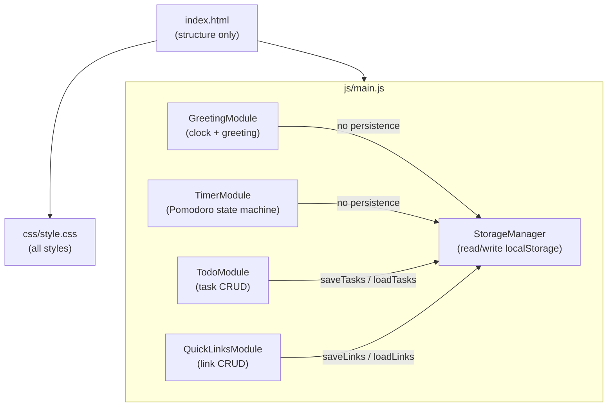
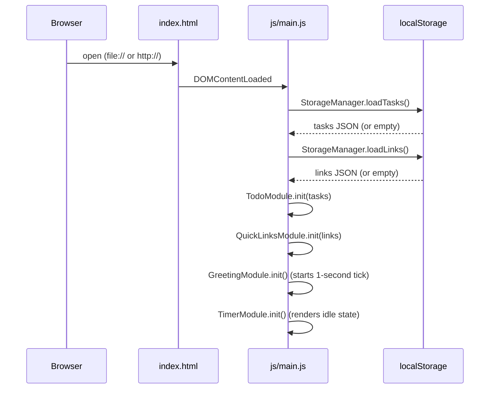
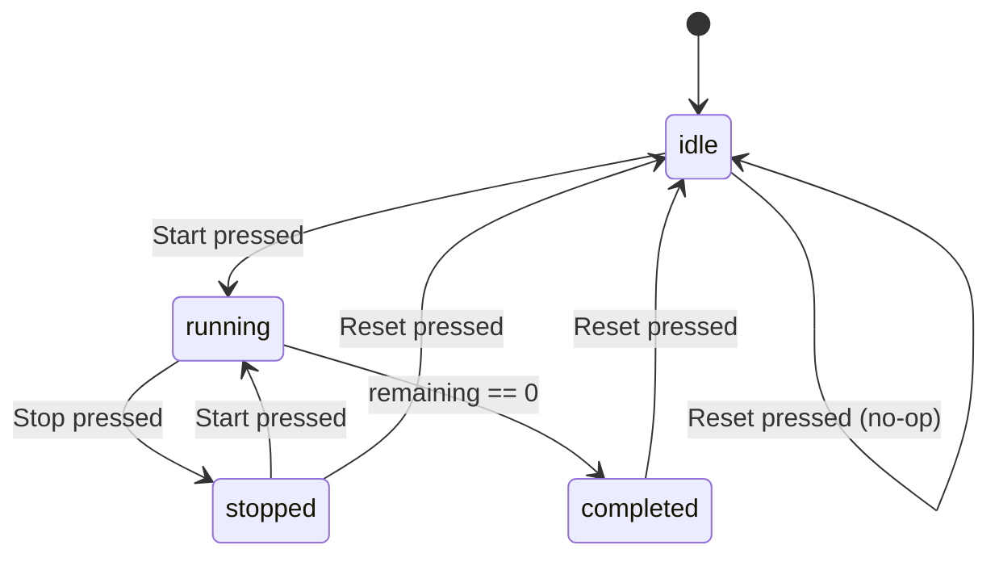

# Design Document — Todo List Dashboard

## Overview

The Todo List Dashboard is a self-contained, single-page productivity application built with plain HTML, CSS, and Vanilla JavaScript. It presents four widgets on one screen: a live Greeting Widget, a Pomodoro-style Focus Timer, a persisted To-Do List, and a Quick Links panel. All state is stored in the browser's `localStorage`; no server, build tool, or external library is involved.

The application must open correctly via the `file://` protocol, meaning every feature — including persistence, timer logic, and audio — must rely only on browser-native APIs that are permitted in a local file context.

**Core design philosophy:**
- One module per concern (Greeting, Timer, TodoList, QuickLinks, StorageManager), all co-located in a single `js/main.js` file using the Revealing Module Pattern (IIFE/closure).
- State is held in memory during a session and written to `localStorage` at every mutation.
- The DOM is the single source of truth for rendering; all mutations go through a small set of render functions.

---

## Architecture

The application follows a flat, modular architecture with no framework. All JavaScript lives in one file (`js/main.js`) organised as self-contained modules using immediately-invoked function expressions (IIFEs) and plain closures. Modules communicate by calling each other's public API functions — there is no shared mutable global state aside from `localStorage`.



**Startup sequence:**



---

## Components and Interfaces

### StorageManager

Responsible for all `localStorage` reads and writes. No other module touches `localStorage` directly.

```
StorageManager
  .loadTasks()   → Task[]          // returns [] on missing/malformed data
  .saveTasks(tasks: Task[]) → void // throws StorageError on quota exceeded
  .loadLinks()   → Link[]          // returns [] on missing/malformed data
  .saveLinks(links: Link[]) → void // throws StorageError on quota exceeded
```

Internal behaviour:
- `loadTasks` / `loadLinks`: calls `JSON.parse`, validates each entry against the required schema, silently discards invalid entries, swallows `SyntaxError` and returns `[]`.
- `saveTasks` / `saveLinks`: calls `JSON.stringify` + `localStorage.setItem`; re-throws any `DOMException` (quota exceeded) so the caller can display an error and roll back.

### GreetingModule

Owns the clock and greeting DOM elements. Runs a `setInterval` tick every 1 000 ms.

```
GreetingModule
  .init() → void   // reads current time, renders, starts interval
  ._tick() → void  // updates clock display + greeting (private)
```

Greeting boundaries (hour in 24-h, inclusive):

| Hour range | Message        |
|------------|----------------|
| 05–11      | Good Morning   |
| 12–17      | Good Afternoon |
| 18–21      | Good Evening   |
| 22–04      | Good Night     |

Clock fallback: if `new Date()` throws or returns `Invalid Date`, display `--:--:--` for time and no greeting text.

### TimerModule

Implements the Pomodoro state machine. Uses `setInterval` (1 000 ms) while running; clears the interval in all other states.

```
TimerModule
  .init() → void        // renders idle state, binds button events
  .start() → void       // idle|stopped → running
  .stop() → void        // running → stopped
  .reset() → void       // any → idle (1500 s)
  ._tick() → void       // decrements remaining, handles completion (private)
```

State machine:



Control availability per state:

| State     | Start   | Stop     | Reset   |
|-----------|---------|----------|---------|
| idle      | enabled | disabled | enabled |
| running   | disabled| enabled  | enabled |
| stopped   | enabled | disabled | enabled |
| completed | disabled| disabled | enabled |

On `completed`: show a visible `#timer-complete-banner` element and call `Audio.play()` on a short beep (base64-encoded data URI so it works via `file://`).

### TodoModule

Manages the in-memory task array and the task list DOM.

```
TodoModule
  .init(tasks: Task[]) → void
  .addTask(description: string) → void
  .editTask(id: string, newTitle: string) → void
  .deleteTask(id: string) → void
  .toggleTask(id: string) → void
  ._renderList() → void             // full re-render of <ul> (private)
  ._enterEditMode(id: string) → void
  ._exitEditMode(id: string, save: boolean) → void
```

Business rules enforced at this layer (before calling StorageManager):
- Reject whitespace-only descriptions (trim → length 0).
- Reject additions when task count ≥ 100.
- At most one task in edit mode simultaneously; a second Edit activation is ignored.
- On StorageManager failure: roll back in-memory state, re-render, show error banner.

### QuickLinksModule

Manages the in-memory link array and the links panel DOM.

```
QuickLinksModule
  .init(links: Link[]) → void
  .addLink(label: string, url: string) → void
  .deleteLink(id: string) → void
  ._renderPanel() → void
```

Validation before calling StorageManager:
- Label: non-empty, ≤ 100 characters.
- URL: non-empty, starts with `http://` or `https://`.
- Reject additions when link count ≥ 50.
- On StorageManager failure: roll back, re-render, show error banner.

---

## Data Models

### Task

```jsonc
{
  "id":        "string  — UUID v4 generated at creation time",
  "title":     "string  — trimmed task description, 1–500 characters",
  "completed": "boolean — false on creation",
  "createdAt": "string  — ISO 8601 date-time, e.g. '2026-08-28T10:00:00.000Z'"
}
```

`localStorage` key: `"tld_tasks"` (tld = todo-list-dashboard, avoids collisions).

### Link

```jsonc
{
  "id":    "string — UUID v4 generated at creation time",
  "label": "string — display text, 1–100 characters",
  "url":   "string — must start with 'http://' or 'https://', max 2048 characters"
}
```

`localStorage` key: `"tld_links"`.

### TimerState (runtime only — not persisted)

```
type TimerState = "idle" | "running" | "stopped" | "completed"

{
  state:     TimerState,
  remaining: number  // seconds, 0–1500
}
```

Timer state is intentionally **not persisted** to `localStorage`; the timer always resets to `idle` on page load.

### UUID generation

Since there is no Node.js `crypto` module available in a pure browser context, IDs are generated with:

```js
function generateId() {
  return crypto.randomUUID
    ? crypto.randomUUID()
    : Date.now().toString(36) + Math.random().toString(36).slice(2);
}
```

`crypto.randomUUID()` is available in all modern browsers (Chrome 92+, Firefox 95+, Safari 15.4+) including in `file://` contexts. The fallback is kept for older environments.

---

## Correctness Properties

*A property is a characteristic or behavior that should hold true across all valid executions of a system — essentially, a formal statement about what the system should do. Properties serve as the bridge between human-readable specifications and machine-verifiable correctness guarantees.*

### Property 1: Greeting message covers all hours

*For any* integer hour value in the range 0–23 (inclusive), the greeting function SHALL return exactly one of the four messages ("Good Morning", "Good Afternoon", "Good Evening", "Good Night") and never return an empty string or an undefined value.

**Validates: Requirements 2.1, 2.2, 2.3, 2.4**

---

### Property 2: Greeting boundary round-trip

*For any* hour value on a boundary (5, 12, 18, 22) and the hour immediately before that boundary, the greeting function SHALL return a different message, confirming the boundary is inclusive on the lower bound and exclusive just before it.

**Validates: Requirements 2.1, 2.2, 2.3, 2.4**

---

### Property 3: Whitespace-only task descriptions are always rejected

*For any* string composed entirely of whitespace characters (spaces, tabs, newlines), submitting it as a task description SHALL leave the task collection unchanged and SHALL not create a new Task object.

**Validates: Requirements 5.5**

---

### Property 4: Valid task addition round-trip

*For any* non-whitespace string of 1–500 characters, adding it as a task SHALL result in a task collection that contains exactly one more task than before, where the new task has the trimmed input as its `title`, `completed` set to `false`, a non-empty `id`, and a valid ISO 8601 `createdAt`.

**Validates: Requirements 5.2, 5.3, 9.3**

---

### Property 5: Task persistence round-trip

*For any* array of valid Task objects, serialising via `StorageManager.saveTasks` then deserialising via `StorageManager.loadTasks` SHALL return an array of Task objects that is structurally equivalent to the original (same ids, titles, completed flags, and createdAt values), with no entries added or dropped.

**Validates: Requirements 9.3, 9.4, 9.6**

---

### Property 6: StorageManager discards invalid entries silently

*For any* JSON array where some entries are missing required fields or contain incorrect types, `StorageManager.loadTasks` SHALL return an array containing only the entries that pass full schema validation, with no exception thrown.

**Validates: Requirements 9.4, 9.5**

---

### Property 7: Task toggle is an involution

*For any* Task, toggling its completion state twice in succession SHALL return the task to its original `completed` value (toggle is its own inverse).

**Validates: Requirements 7.2, 7.3**

---

### Property 8: Task edit preserves identity

*For any* Task and any valid (non-whitespace) replacement description, editing the task SHALL leave its `id` and `createdAt` unchanged and SHALL update only its `title` to the trimmed value.

**Validates: Requirements 6.3, 6.4**

---

### Property 9: Task cap enforcement

*For any* task collection at capacity (100 tasks), attempting to add another task SHALL leave the collection unchanged at exactly 100 tasks.

**Validates: Requirements 5.6**

---

### Property 10: Invalid URL is always rejected

*For any* string that does not begin with `http://` or `https://`, submitting it as a link URL SHALL not create a new Link and SHALL leave the link collection unchanged.

**Validates: Requirements 11.6**

---

### Property 11: Link persistence round-trip

*For any* array of valid Link objects, serialising via `StorageManager.saveLinks` then deserialising via `StorageManager.loadLinks` SHALL return an array structurally equivalent to the original.

**Validates: Requirements 10.3, 11.3**

---

### Property 12: Timer state machine — valid transitions only

*For any* sequence of Start, Stop, and Reset control activations, the timer SHALL never enter an undefined state and the `remaining` value SHALL always be in the range [0, 1500].

**Validates: Requirements 3.1, 3.2, 3.4, 4.2, 4.3, 4.4**

---

### Property 13: Timer countdown monotonicity

*For any* running timer session, each successive tick SHALL decrease `remaining` by exactly 1 second until `remaining` reaches 0, at which point no further decrement occurs.

**Validates: Requirements 3.2, 3.3, 3.4**

---

## Error Handling

| Scenario | Component | Response |
|---|---|---|
| `localStorage` quota exceeded on write | StorageManager | Re-throw `StorageError`; caller rolls back in-memory state, shows error banner |
| Malformed JSON in `localStorage` on load | StorageManager | Return `[]`, do not throw |
| Invalid task entry during deserialization | StorageManager | Silently discard entry, continue with valid entries |
| Whitespace-only task description submitted | TodoModule | Show inline error: "Task description cannot be empty." |
| Task limit (100) reached | TodoModule | Show inline error: "Maximum number of tasks reached." |
| Edit confirmed with whitespace-only value | TodoModule | Restore original description, close edit mode, no error banner |
| Device clock unavailable | GreetingModule | Display `--:--:--`; show no greeting text; no exception |
| `Audio.play()` rejected (e.g., autoplay policy) | TimerModule | Show visual completion banner only; log warning to console |
| Timer activated in wrong state | TimerModule | Ignore silently; current state preserved |
| Link URL missing `http://`/`https://` prefix | QuickLinksModule | Show inline error: "URL must start with http:// or https://" |
| Link label or URL field empty | QuickLinksModule | Show inline error identifying the empty field |
| Link limit (50) reached | QuickLinksModule | Show inline error: "Maximum number of links reached." |
| StorageManager fails on link save | QuickLinksModule | Roll back add/delete, re-render, show error banner |
| `file://` protocol blocks a resource | All modules | Display inline warning per Requirement 15.3; other widgets remain functional |

All error messages are displayed in a dedicated `#error-banner` element per widget (or a shared global banner for StorageManager errors). Banners auto-dismiss after 5 seconds or when the user dismisses them manually.

---

## Testing Strategy

### Unit Tests (example-based)

Focus on concrete scenarios that confirm specific behaviour:

- GreetingModule: each of the four hour boundaries (04→05, 11→12, 17→18, 21→22) returns the correct greeting.
- GreetingModule: fallback display when `new Date()` is mocked to throw.
- TimerModule: each valid state transition (idle→running, running→stopped, etc.).
- TimerModule: activating Start while `running` is a no-op.
- TimerModule: `remaining` is exactly 0 after `completed` transition; no further decrement.
- TodoModule: adding a task with a 500-character title succeeds; 501-character title is rejected.
- TodoModule: editing and pressing Escape restores original title.
- TodoModule: attempting to enter edit mode on a second task while one is already in edit mode has no effect.
- QuickLinksModule: URL starting with `ftp://` is rejected.
- QuickLinksModule: label truncated to 100 characters in display but full URL preserved.
- StorageManager: returns `[]` when `localStorage` contains `null` for the key.
- StorageManager: entries missing `id`, `title`, `completed`, or `createdAt` are discarded.

### Property-Based Tests

The project uses **[fast-check](https://github.com/dubzzz/fast-check)** (loaded as a module in the test environment only — not referenced from `index.html`). Each property test runs a minimum of **100 iterations**.

Each test is tagged with a comment in the format:
`// Feature: todo-list-dashboard, Property N: <property text>`

| Property | Test Description |
|---|---|
| P1 — Greeting covers all hours | Arbitrary integer 0–23 → `getGreeting(h)` ∈ {"Good Morning", "Good Afternoon", "Good Evening", "Good Night"} |
| P2 — Greeting boundary round-trip | Hours at boundaries return different messages than hours just before boundaries |
| P3 — Whitespace rejection | Arbitrary whitespace string → `TodoModule.addTask` leaves list unchanged |
| P4 — Valid task addition round-trip | Arbitrary non-whitespace string (1–500 chars) → task count increases by 1, new task has correct structure |
| P5 — Task persistence round-trip | Arbitrary `Task[]` → `saveTasks` then `loadTasks` returns equivalent array |
| P6 — StorageManager discards invalid entries | Arbitrary JSON arrays with some invalid entries → only valid entries returned, no exception |
| P7 — Toggle involution | Arbitrary Task → toggle twice → `completed` value unchanged |
| P8 — Edit preserves identity | Arbitrary Task + valid new title → `id` and `createdAt` unchanged after edit |
| P9 — Task cap enforcement | Task array at 100 items → add attempt → array stays at 100 |
| P10 — Invalid URL rejected | Arbitrary string not starting with `http://` or `https://` → link collection unchanged |
| P11 — Link persistence round-trip | Arbitrary `Link[]` → `saveLinks` then `loadLinks` returns equivalent array |
| P12 — Timer state machine validity | Arbitrary sequence of Start/Stop/Reset calls → state always in valid set, remaining ∈ [0, 1500] |
| P13 — Timer countdown monotonicity | Simulate N ticks → remaining decreases by exactly N until 0, then stays 0 |

### Integration / Smoke Tests

These are run with a real browser (Playwright or manual) and are example-based (1–3 executions each):

- Dashboard loads from `file://` in Chrome, Firefox, Edge, Safari without console errors.
- All four widgets are visible and interactive within 2 seconds.
- Tasks and links survive a full page reload (written to `localStorage`, read back on init).
- Timer completes a full 1500-second countdown and shows the completion banner + plays audio (or shows visual-only fallback if autoplay is blocked).
- `localStorage` quota-exceeded error surfaces a visible error banner rather than a silent failure.
